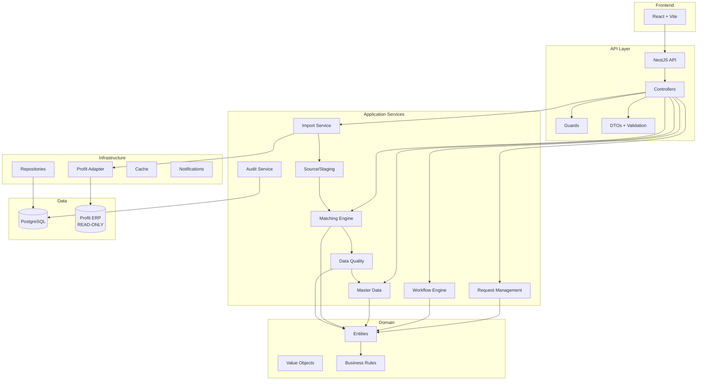
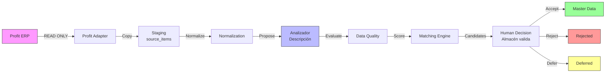
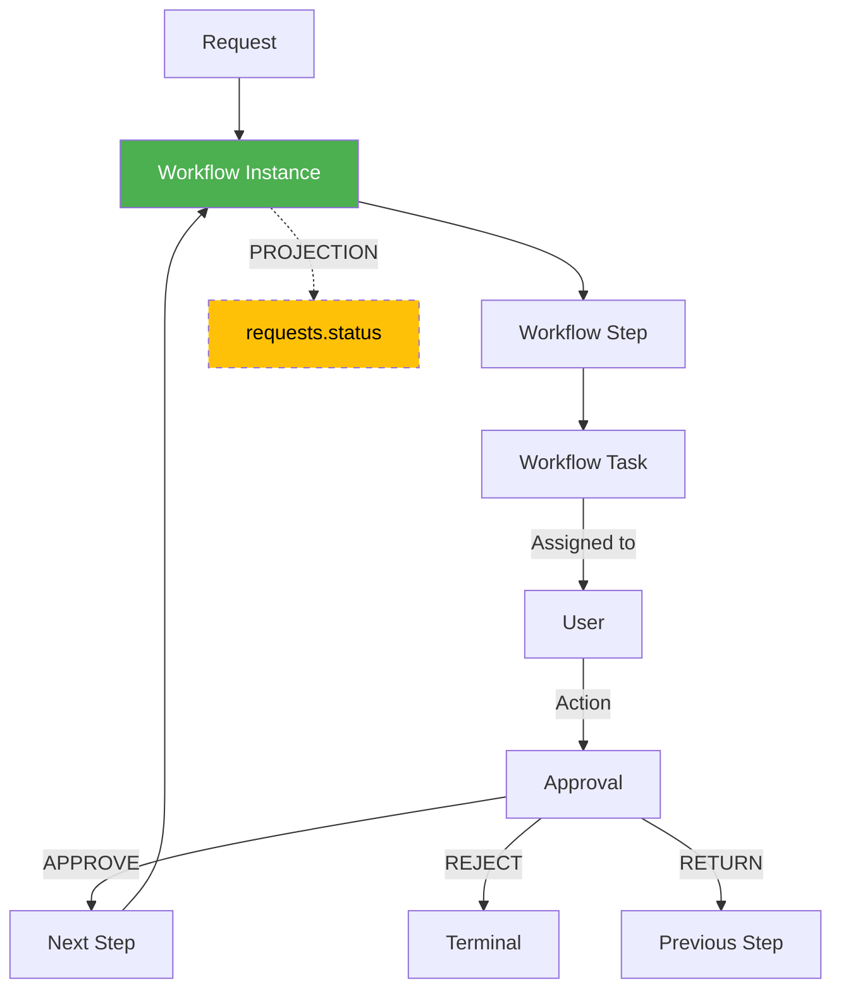

# Arquitectura técnica

## Objetivo

Construir un modular monolith empresarial que pueda evolucionar posteriormente sin acoplar el dominio al ERP Profit.

## Stack

### Backend
- Node.js
- TypeScript strict
- NestJS
- Prisma
- PostgreSQL
- REST/OpenAPI

### Frontend
- React
- TypeScript
- Vite
- TanStack Query
- React Hook Form
- Zod
- UI component library

### Infraestructura
- Docker Compose en desarrollo
- PostgreSQL
- SQL Server/Profit como sistema externo (READ-ONLY)
- Almacenamiento de archivos configurable

## Diagrama de arquitectura general



## Flujo de datos — Profit a Master

> **Nota Fase 0.1:** La descripción es fuente semántica principal. El Analizador de Descripción propone clasificación; Almacén valida. Contabilidad no clasifica.



### Analizador de Descripción vs Matching

| Analizador | Matching |
|------------|----------|
| Interpreta la descripción y propone `grupo/subgrupo/categoría/marca/modelo/aplicación/atributos` | Busca Master Items equivalentes existentes |
| No decide; genera propuesta con `confidence` y `evidence` | No decide; genera candidatos con score |
| Fuente: `source_items.original_description` | Fuente: datos normalizados + clasificación |

### Clasificación del Artículo

Clasificación explícita mínima: `Grupo + Subgrupo + Categoría`. Opcionales según categoría: `Marca, Fabricante, Modelo, Part Number, Unidad, Aplicación, Atributos técnicos`. Nunca asumir clasificación correcta solo porque vino de Profit.

### Regla de Integridad Fundamental — Master Code derivado

```
group_id + subgroup_id + correlativo
        ↓
master_code   (ej: RVH + CAR + 000001 = RVHCAR000001)
```
La fuente de verdad es `master_item.group_id / subgroup_id`. El código es representación derivada. Nunca usar `master_code` para inferir grupo/subgrupo. Ver `docs/master-data-model.md` § Master Code.

### Contabilidad desacoplada

Contabilidad **NO** participa en inferencia de grupo/subgrupo/categoría/marca/modelo. No existe dependencia `Grupo contable → Grupo MDM` ni viceversa salvo integración explícita futura. `Data Quality` y `Matching` no usan campos contables.

### Trazabilidad

Debe reconstruirse: descripción Profit → propuesta analizador → revisión Almacén → clasificación aprobada → código generado → cambios posteriores (quién/cuándo/por qué). Todo en `versions` + `audit.events`.

### Seguridad — Password Policy

- Longitud mínima 8, al menos 2 números, al menos 1 carácter especial
- Hash seguro (bcrypt/argon2), validación en application layer, nunca texto plano en DB (ver `docs/decisions.md` ADR-022)

## Flujo de workflow



### Regla de sincronización

```
workflow_instances.current_step_id
        ↓
workflow_steps.code (ej: 'PENDING_MANAGER')
        ↓
requests.status (PROYECCIÓN, nunca fuente de verdad)
```

`requests.status` se actualiza SOLO como resultado de una transición de workflow exitosa, dentro de la misma transacción.

## Multiempresa — Aislamiento

```mermaid
graph TB
    subgraph "GLOBAL (sin company_id)"
        U[users]
        MI[master_items]
        B[brands]
        M[manufacturers]
        MOD[models]
        R[roles]
        P[permissions]
        CG[catalog_groups]
        CS[catalog_subgroups]
        CC[catalog_categories]
        UOM[units_of_measure]
    end

    subgraph "SCOPED POR EMPRESA"
        CO[companies]
        D[departments]
        UR[user_roles]
        REQ[requests]
        S[sources]
        SI[source_items]
        MS[master_item_source_map]
        AI[item_aliases]
        AE[audit.events]
    end

    CO --> D
    CO --> UR
    CO --> REQ
    CO --> S
    S --> SI
    CO --> AE
    CO --> MS
    CO --> AI

    U --> UR
    R --> UR
    CO --> UR

    style U fill:#E3F2FD
    style MI fill:#E3F2FD
    style B fill:#E3F2FD
    style M fill:#E3F2FD
    style MOD fill:#E3F2FD
    style R fill:#E3F2FD
    style P fill:#E3F2FD
    style CG fill:#E3F2FD
    style CS fill:#E3F2FD
    style CC fill:#E3F2FD
    style UOM fill:#E3F2FD
    style CO fill:#C8E6C9
    style D fill:#C8E6C9
    style UR fill:#C8E6C9
    style REQ fill:#C8E6C9
    style S fill:#C8E6C9
    style SI fill:#C8E6C9
    style MS fill:#C8E6C9
    style AI fill:#C8E6C9
    style AE fill:#C8E6C9
```



### Reglas de aislamiento

1. **REQUEST** pertenece a UNA empresa via `company_id`
2. **DEPARTMENT** pertenece a UNA empresa via `company_id` (NOT NULL)
3. **USER_ROLES** tiene `company_id` NOT NULL — roles son por empresa
4. **SOURCES** pertenecen a una empresa via `company_id`
5. **SOURCE_ITEMS** heredan empresa de `sources`
6. **MASTER_ITEMS** son GLOBALES pero con `created_by_company_id` para trazabilidad
7. **AUDIT** registra `actor_company_id` para filtrado por empresa

## Patrón por módulo backend

```text
module/
├── presentation/
│   ├── controllers/
│   └── dto/
├── application/
│   ├── use-cases/
│   └── services/
├── domain/
│   ├── entities/
│   ├── value-objects/
│   └── services/
├── infrastructure/
│   ├── repositories/
│   └── adapters/
└── module.ts
```

## Regla de dependencia

```text
Presentation
     ↓
Application
     ↓
Domain
     ↑
Infrastructure
```

Infrastructure implementa interfaces definidas por capas superiores cuando sea necesario.

## Contextos principales

1. Identity & Access
2. Organization
3. Catalog
4. Request Management
5. Approval Workflow
6. Master Data
7. Matching
8. Data Quality
9. Profit Integration
10. Import/Staging
11. Accounting
12. Audit
13. Notifications

## Integración Profit

```text
Profit (READ-ONLY)
  ↓
Profit Adapter
  ↓
Staging (source_items)
  ↓
Normalization
  ↓
Analizador de Descripción (propone grupo/subgrupo → Almacén valida)
  ↓
Data Quality (evalúa completitud, NO clasifica)
  ↓
Matching (busca equivalentes, NO decide)
  ↓
Master Data (código = GRUPO+SUBGRUPO+correlativo)
```

> **Profit ejemplo real:** `RVHCAR0001` donde `RVH`=Grupo (Repuestos vehículos), `CAR`=Subgrupo (Carrocería), `0001`=correlativo. El MDM conserva el concepto pero genera `RVHCAR000001` de forma controlada y auditable.

Nunca:

```text
React → Profit
```

## Idempotencia

Las importaciones deben poder ejecutarse varias veces sin duplicar registros de origen. Cada source_item se identifica por `(source_id, source_record_id)`. Se usa `content_hash` para detectar cambios.

## Concurrencia

Las aprobaciones y fusiones deben usar optimistic locking (`version` column) y validar versión/estado actual antes de confirmar. Ver `docs/concurrency.md` para detalles.

## Estructura del proyecto

```text
master-data-platform/
├── AGENTS.md
├── README.md
├── package.json
├── pnpm-workspace.yaml
├── opencode.jsonc
├── apps/
│   ├── api/
│   │   └── src/
│   │       ├── main.ts
│   │       ├── app.module.ts
│   │       ├── modules/
│   │       │   ├── auth/
│   │       │   ├── users/
│   │       │   ├── organizations/
│   │       │   ├── catalog/
│   │       │   ├── requests/
│   │       │   ├── approvals/
│   │       │   ├── warehouse/
│   │       │   ├── accounting/
│   │       │   ├── master-data/
│   │       │   ├── matching/
│   │       │   ├── profit/
│   │       │   ├── import/
│   │       │   ├── audit/
│   │       │   └── notifications/
│   │       ├── shared/
│   │       └── config/
│   └── web/
│       └── src/
│           ├── app/
│           ├── routes/
│           ├── features/
│           ├── components/
│           ├── hooks/
│           ├── lib/
│           └── services/
├── packages/
│   ├── shared/
│   ├── contracts/
│   └── config/
├── db/
│   ├── schema.sql
│   └── seeds/
├── docs/
├── tests/
└── .opencode/
    ├── skills/
    ├── agents/
    └── commands/
```
