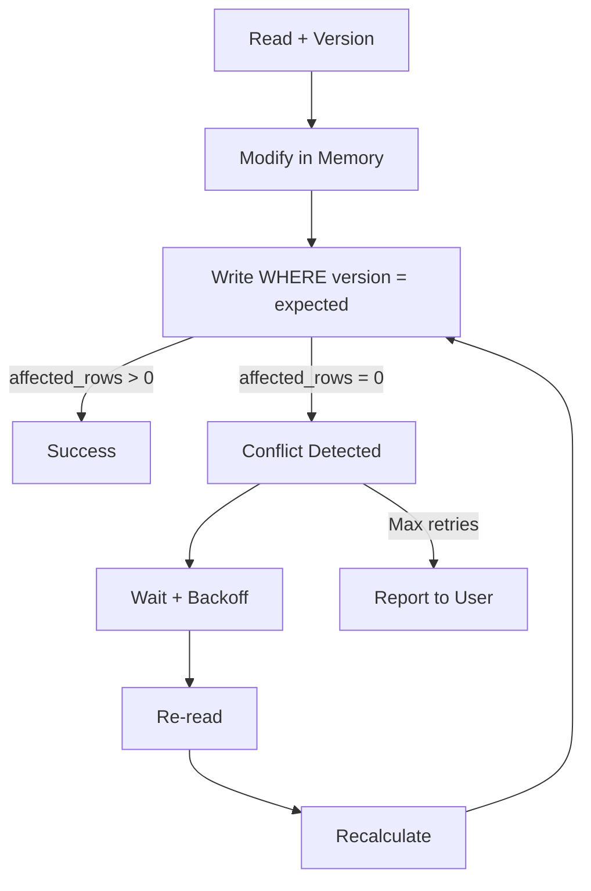

# Estrategia de Concurrencia

## Visión general

El sistema opera en un entorno multiusuario donde múltiples usuarios pueden modificar los mismos registros simultáneamente. Se utiliza optimistic locking para prevenir lost updates.

## Optimistic Locking

### Concepto

Optimistic locking asume que los conflictos son raros. En lugar de bloquear registros durante la lectura, se valida la versión al momento de escribir.

### Mecanismo

```
1. LEER registro (incluyendo version)
2. MODIFICAR en memoria
3. ESCRIBIR con WHERE version = @expected_version
4. Si affected_rows = 0 → CONFLICTO DE CONCURRENCIA
5. Releer, recalcular, reintentar
```

### Tablas con optimistic locking

| Tabla | Columna | Justificación |
|-------|---------|---------------|
| `mdm.master_items` | `version INTEGER NOT NULL DEFAULT 1` | Dos usuarios editando el mismo item |
| `mdm.requests` | `version INTEGER NOT NULL DEFAULT 1` | Dos aprobadores actuando simultáneamente |
| `mdm.match_candidates` | `version INTEGER NOT NULL DEFAULT 1` | Dos reviewers confirmando/rechazando |
| `mdm.workflow_instances` | `version INTEGER NOT NULL DEFAULT 1` | Dos transiciones simultáneas |
| `mdm.workflow_tasks` | `version INTEGER NOT NULL DEFAULT 1` | Dos usuarios tomando la misma tarea |

### Tablas SIN optimistic locking

| Tabla | Justificación |
|-------|---------------|
| `mdm.master_item_source_map` | Operaciones atómicas (INSERT/DELETE) |
| `mdm.item_aliases` | Operaciones atómicas |
| `mdm.approvals` | Solo INSERT, nunca UPDATE |
| `audit.events` | Solo INSERT, nunca UPDATE |

## Escenarios de concurrencia

### 1. Dos usuarios editan el mismo master item

```
Usuario A lee master_item (version=1)
Usuario B lee master_item (version=1)
Usuario A guarda (version=1 → 2) → OK
Usuario B guarda (version=1 → 2) → FAIL (version ya es 2)
Usuario B relee (version=2), reintentar
```

### 2. Dos usuarios aprueban la misma request

```
Usuario A lee workflow_instance (version=1, step=PENDING_MANAGER)
Usuario B lee workflow_instance (version=1, step=PENDING_MANAGER)
Usuario A aprueba (version=1 → 2, step→MANAGER_APPROVED) → OK
Usuario B aprueba (version=1 → 2) → FAIL
Usuario B relee: step ya es MANAGER_APPROVED
La transición ya no es válida desde MANAGER_APPROVED
```

### 3. Dos reviewers deciden el mismo candidato

```
Usuario A lee match_candidate (version=1, status=PENDING_REVIEW)
Usuario B lee match_candidate (version=1, status=PENDING_REVIEW)
Usuario A acepta (version=1 → 2, status→CONFIRMED_SAME) → OK
Usuario B acepta (version=1 → 2) → FAIL
Usuario B relee: status ya es CONFIRMED_SAME
```

### 4. Dos usuarios toman la misma tarea

```
Usuario A lee workflow_task (version=1, status=PENDING, assigned_to=NULL)
Usuario B lee workflow_task (version=1, status=PENDING, assigned_to=NULL)
Usuario A reclama (version=1 → 2, assigned_to=A) → OK
Usuario B reclama (version=1 → 2) → FAIL
Usuario B relee: assigned_to ya es A
La tarea ya no está disponible
```

### 5. Dos transiciones de workflow

```
Instancia en step=PENDING_WAREHOUSE (version=1)
Warehouse A aprueba (version=1 → 2, step→WAREHOUSE_APPROVED) → OK
Warehouse B intenta aprobar (version=1 → 2) → FAIL
Warehouse B relee: step ya es WAREHOUSE_APPROVED
La transición ya no es válida
```

## Transaction boundaries

### Operaciones que requieren transacción

| Operación | Tablas afectadas | ¿Transacción? |
|-----------|------------------|---------------|
| Transición de workflow | workflow_instances, workflow_tasks, workflow_history, requests, approvals | SÍ |
| Merge de master items | master_items, master_item_source_map, item_aliases, match_candidates, requests | SÍ |
| Split de master items | master_items, master_item_source_map, item_aliases, match_candidates | SÍ |
| Aprobación de solicitud | workflow_instances, workflow_tasks, requests | SÍ |
| Importación de datos | source_items, source_item_versions, import_runs | SÍ |

### Operaciones atómicas (sin transacción compleja)

| Operación | Tabla | ¿Transacción? |
|-----------|-------|---------------|
| Crear alias | item_aliases | Simple INSERT |
| Crear audit event | audit.events | Simple INSERT |
| Crear match_decision | match_decisions | Simple INSERT |

### Generación de Master Code por prefijo (Fase 0.1)

```
Correlativo es por combinación grupo+subgrupo.
Secuencia centralizada: mdm.master_code_sequences(group_id, subgroup_id, last_value)
Transacción: SELECT ... FOR UPDATE por prefijo → nextval → master_code = GROUP||SUBGROUP||LPAD(nextval, seq_len, '0')
Garantiza unicidad por prefijo, no reutilización, gaps aceptados.
Si Almacén cambia grupo/subgrupo antes de activar: nueva transacción genera nuevo código con nuevo prefijo; código viejo queda en versiones/auditoría.
```

## Pessimistic locking

### Cuándo usar

- Generación de master_code por prefijo (bloquear fila de secuencia)
- Merge de master items (requiere bloquear source y target)
- Transiciones de workflow (requiere bloquear instancia)
- Importaciones concurrentes del mismo source

### Mecanismo

```sql
-- Conceptual:
BEGIN;
SELECT * FROM mdm.master_items WHERE id = @source_id FOR UPDATE;
SELECT * FROM mdm.master_items WHERE id = @target_id FOR UPDATE;
-- Ejecutar merge
COMMIT;
```

### Deadlock prevention

- Siempre adquirir locks en orden consistente (UUID menor primero)
- Usar timeout de lock (no esperar indefinidamente)
- Si timeout → reintentar con backoff exponencial

## Retry strategy

### Para conflictos de optimistic locking

```
1. Detectar conflicto (affected_rows = 0)
2. Esperar 100ms
3. Releer registro
4. Recalcular cambios
5. Reintentar WRITE
6. Si falla 3 veces → informar al usuario
```

### Para deadlocks

```
1. Detectar deadlock (PostgreSQL error 40P01)
2. Esperar 200ms * attempt_number
3. Reintentar transacción completa
4. Si falla 5 veces → informar al usuario
```

## Idempotency

### Importaciones

- `UNIQUE(source_id, source_record_id)` previene duplicados
- `content_hash` detecta si los datos cambiaron
- Re-importar el mismo registro es seguro

### Aprobaciones

- `UNIQUE(instance_id, step_id)` en workflow_tasks previene tareas duplicadas
- Validar versión antes de aprobar previene aprobaciones duplicadas

### Merge

- Validar que source y target están ACTIVE antes de merge
- Usar transacción para garantizar atomicidad
- Registrar en merge_history para trazabilidad

## Unique constraints como prevención

| Constraint | Tabla | Previene |
|------------|-------|----------|
| `UNIQUE(source_id, source_record_id)` | source_items | Importaciones duplicadas |
| `UNIQUE(request_id)` | workflow_instances | Múltiples workflows por solicitud |
| `UNIQUE(instance_id, step_id)` | workflow_tasks | Tareas duplicadas por paso |
| `UNIQUE(master_item_id, source_item_id)` | master_item_source_map | Mapeos duplicados |
| `UNIQUE(master_item_id, normalized_alias)` | item_aliases | Aliases duplicados |
| `UNIQUE(user_id, role_id, company_id)` | user_roles | Roles duplicados |

## Índices para concurrencia

Los índices siguientes mejoran el rendimiento de queries que se ejecutan frecuentemente bajo concurrencia:

```sql
-- Workflow tasks pendientes
CREATE INDEX idx_workflow_tasks_status ON mdm.workflow_tasks(status);
CREATE INDEX idx_workflow_tasks_assigned ON mdm.workflow_tasks(assigned_to) WHERE assigned_to IS NOT NULL;

-- Requests pendientes
CREATE INDEX idx_requests_status ON mdm.requests(status);
CREATE INDEX idx_requests_company ON mdm.requests(company_id);

-- Match candidates pendientes
CREATE INDEX idx_match_candidates_status ON mdm.match_candidates(status);

-- Source items para importación
CREATE INDEX idx_source_items_hash ON profit_staging.source_items(content_hash);
```

## Estrategia completa



## Reglas

1. **Toda operación de escritura en tablas con version debe validar versión**
2. **Las transacciones deben ser lo más cortas posible**
3. **Nunca mantener locks largos sobre tablas de alto tráfico**
4. **Usar retry con backoff exponencial para conflictos**
5. **Registrar conflictos en audit para monitoreo**
6. **Informar al usuario después de max retries**
