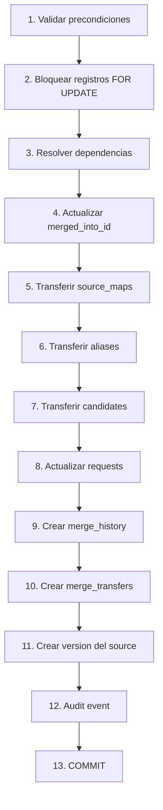
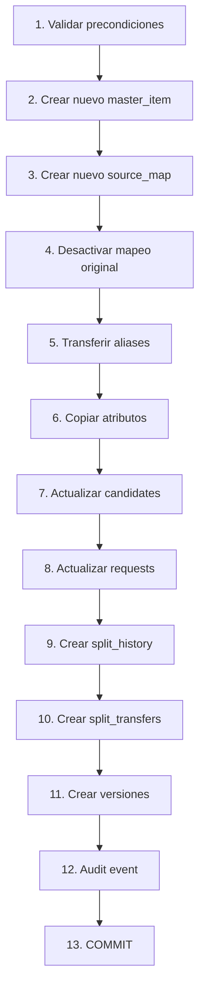

# Estrategia de Merge y Split

## Definiciones

### Merge

**Merge:** Operación que combina dos master items en uno solo. El item absorbido (source) pierde su estado ACTIVE y apunta al item sobreviviente (target).

### Split

**Split:** Operación que separa un source item incorrectamente vinculado a un master item, creando un nuevo master item independiente. NO revierte un merge existente.

### Términos

| Término | Definición |
|---------|------------|
| **Source master** | Master item que será absorbido en un merge |
| **Target master** | Master item que sobrevive en un merge |
| **Canonical master** | Master item que actualmente "sobrevive" y es ACTIVE |
| **Root master** | Master item original que fue absorbido (status = MERGED) |

## MERGE

### Definición formal

```
MASTER-A (source) → MASTER-B (target)

Después del merge:
  MASTER-A.status = MERGED
  MASTER-A.merged_into_id = MASTER-B.id
  MASTER-B se mantiene ACTIVE
```

### Precondiciones

| Condición | Descripción |
|-----------|-------------|
| Source ACTIVE | El item a absorber debe estar ACTIVE |
| Target ACTIVE | El item sobreviviente debe estar ACTIVE |
| Source ≠ Target | No se puede mergear un item consigo mismo |
| Target no MERGED | No se puede mergear en un item ya MERGED |
| No cadena pendiente | Si source tiene merged_into_id, resolver primero |

### Cadena de resolución

**REGLA FORMAL:** Antes de ejecutar B→C, todos los masters que apuntan a B deben pasar a C.

```
ANTES:
  A → B
  B → C (pendiente)

DESPUÉS:
  A → C
  B → C
```

**NUNCA:**
```
A → B → C (cadena inconsistente)
```

### Secuencia de merge



### Operaciones detalladas

#### 1. Validar precondiciones

```sql
-- Conceptual:
SELECT status FROM mdm.master_items WHERE id = @source_id;
-- Debe ser ACTIVE

SELECT status FROM mdm.master_items WHERE id = @target_id;
-- Debe ser ACTIVE

SELECT merged_into_id FROM mdm.master_items WHERE id = @source_id;
-- Debe ser NULL (no tiene merge pendiente)

-- Verificar que no hay cadenas pendientes
SELECT COUNT(*) FROM mdm.master_items WHERE merged_into_id = @source_id;
-- Si > 0, resolver primero
```

#### 2. Bloquear registros

```sql
BEGIN;
SELECT * FROM mdm.master_items WHERE id = @source_id FOR UPDATE;
SELECT * FROM mdm.master_items WHERE id = @target_id FOR UPDATE;
```

#### 3. Resolver dependencias

```sql
-- Actualizar todos los items que apuntan al source
UPDATE mdm.master_items
SET merged_into_id = @target_id
WHERE merged_into_id = @source_id;
```

#### 4. Actualizar merged_into_id

```sql
UPDATE mdm.master_items
SET status = 'MERGED',
    merged_into_id = @target_id,
    merge_reason = @reason,
    version = version + 1,
    updated_at = now()
WHERE id = @source_id;
```

#### 5. Transferir source_maps

```sql
-- Desactivar mapeos existentes del target al mismo source (si existen)
UPDATE mdm.master_item_source_map
SET active = false, updated_at = now()
WHERE master_item_id = @target_id
AND source_item_id IN (
  SELECT source_item_id FROM mdm.master_item_source_map
  WHERE master_item_id = @source_id
);

-- Transferir mapeos del source al target
UPDATE mdm.master_item_source_map
SET master_item_id = @target_id,
    updated_at = now()
WHERE master_item_id = @source_id;

-- Marcar como transferidos los que ya existían en target
UPDATE mdm.master_item_source_map
SET active = false,
    updated_at = now()
WHERE master_item_id = @target_id
AND source_item_id IN (
  SELECT si2.source_item_id
  FROM mdm.master_item_source_map si1
  JOIN mdm.master_item_source_map si2 ON si1.source_item_id = si2.source_item_id
  WHERE si1.master_item_id = @source_id
  AND si2.master_item_id = @target_id
);
```

#### 6. Transferir aliases

```sql
-- Insertar aliases del source en el target (deduplicar)
INSERT INTO mdm.item_aliases (master_item_id, alias, normalized_alias, source, company_id, created_at)
SELECT @target_id, alias, normalized_alias, source, company_id, now()
FROM mdm.item_aliases
WHERE master_item_id = @source_id
AND normalized_alias NOT IN (
  SELECT normalized_alias FROM mdm.item_aliases WHERE master_item_id = @target_id
);

-- Marcar aliases originales como inactivos (no eliminar)
UPDATE mdm.item_aliases
SET master_item_id = @target_id
WHERE master_item_id = @source_id
AND normalized_alias IN (
  SELECT normalized_alias FROM mdm.item_aliases WHERE master_item_id = @target_id
);
```

#### 7. Transferir candidates

```sql
-- Actualizar candidates para apuntar al target
UPDATE mdm.match_candidates
SET master_item_id = @target_id,
    updated_at = now()
WHERE master_item_id = @source_id;
```

#### 8. Actualizar requests

```sql
-- Actualizar suggested_master_item_id
UPDATE mdm.requests
SET suggested_master_item_id = @target_id,
    updated_at = now()
WHERE suggested_master_item_id = @source_id;
```

#### 9. Crear merge_history

```sql
INSERT INTO mdm.merge_history (
  source_item_id, target_item_id, merge_type, reason,
  performed_by, performed_at, created_at
) VALUES (
  @source_id, @target_id, 'FULL_MERGE', @reason,
  @actor_id, now(), now()
);
```

#### 10. Crear merge_transfers

```sql
-- Documentar cada transferencia
INSERT INTO mdm.merge_transfers (merge_id, transfer_type, source_entity_id, target_entity_id, action, created_at)
VALUES
  (@merge_id, 'SOURCE_MAP', @source_map_id, @target_map_id, 'TRANSFERRED', now()),
  (@merge_id, 'ALIAS', @alias_id, @target_alias_id, 'TRANSFERRED', now()),
  (@merge_id, 'CANDIDATE', @candidate_id, NULL, 'MERGED', now());
```

#### 11. Crear version

```sql
INSERT INTO mdm.master_item_versions (
  master_item_id, version, master_code, master_description,
  normalized_description, status, ..., changed_by, changed_at, diff
)
SELECT
  id, version, master_code, master_description,
  normalized_description, 'MERGED', ...,
  @actor_id, now(), '{"status": {"old": "ACTIVE", "new": "MERGED"}}'
FROM mdm.master_items WHERE id = @source_id;
```

#### 12. Audit event

```sql
INSERT INTO audit.events (
  correlation_id, request_id, actor_id, actor_ip, actor_company_id,
  entity_type, entity_id, action, before_data, after_data, metadata, created_at
) VALUES (
  @correlation_id, @request_id, @actor_id, @actor_ip, @actor_company_id,
  'MASTER_ITEM', @source_id, 'MERGE',
  '{"status": "ACTIVE"}',
  '{"status": "MERGED", "merged_into_id": "' || @target_id || '"}',
  '{"target_id": "' || @target_id || '", "reason": "' || @reason || '"}',
  now()
);
```

### Canonical master resolution

```sql
CREATE OR REPLACE FUNCTION mdm.resolve_canonical(p_master_id UUID)
RETURNS UUID AS $$
DECLARE
  v_current UUID := p_master_id;
  v_next UUID;
BEGIN
  LOOP
    SELECT merged_into_id INTO v_next
    FROM mdm.master_items
    WHERE id = v_current;
    
    IF v_next IS NULL OR v_next = v_current THEN
      RETURN v_current;
    END IF;
    
    v_current := v_next;
  END LOOP;
END;
$$ LANGUAGE plpgsql;
```

### Uso

```sql
-- Encontrar el canonical de cualquier master_item
SELECT mdm.resolve_canonical(master_item_id) FROM master_items WHERE id = '...';

-- Verificar si un item es el canonical
SELECT * FROM master_items WHERE id = mdm.resolve_canonical(@id) AND status = 'ACTIVE';
```

## SPLIT

### Definición formal

```
SPLIT separa un source_item incorrectly vinculado a un master_item.
Crea un NUEVO master_item independiente.
NO revierte un merge existente.
```

### Precondiciones

| Condición | Descripción |
|-----------|-------------|
| Source map activo | El mapeo a separar debe estar activo |
| Razón documentada | Se requiere razón para el split |
| Actor con permisos | Solo MASTER_DATA_ADMIN puede ejecutar split |

### Secuencia de split



### Operaciones detalladas

#### 1. Validar precondiciones

```sql
-- Verificar que el mapeo existe y está activo
SELECT * FROM mdm.master_item_source_map
WHERE id = @source_map_id AND active = true;
```

#### 2. Crear nuevo master_item

```sql
INSERT INTO mdm.master_items (
  master_code, master_description, normalized_description,
  status, group_id, subgroup_id, category_id, brand_id,
  manufacturer_id, model_id, unit_id, part_number, application,
  attributes, created_by, created_by_company_id, version
)
SELECT
  -- Generar nuevo master_code = GROUP||SUBGROUP||SEQUENCE (ej RVHCAR000001) — ver ADR-019; correlativo por prefijo
  (SELECT code FROM mdm.catalog_groups WHERE id = mi.group_id) || (SELECT code FROM mdm.catalog_subgroups WHERE id = mi.subgroup_id) || LPAD(next_master_seq(mi.group_id, mi.subgroup_id)::TEXT, 6, '0'),
  si.original_description,
  si.normalized_description,
  'PENDING_REVIEW',
  mi.group_id, mi.subgroup_id, mi.category_id, mi.brand_id,
  mi.manufacturer_id, mi.model_id, mi.unit_id, mi.part_number, mi.application,
  mi.attributes,
  @actor_id,
  @actor_company_id,
  1
FROM profit_staging.source_items si
JOIN mdm.master_item_source_map ms ON ms.source_item_id = si.id
JOIN mdm.master_items mi ON mi.id = ms.master_item_id
WHERE ms.id = @source_map_id;
```

#### 3. Crear nuevo source_map

```sql
INSERT INTO mdm.master_item_source_map (
  master_item_id, source_item_id, relation_type, confidence,
  company_id, confirmed_by, confirmed_at, active, created_at, updated_at
)
SELECT
  @new_master_id,
  ms.source_item_id,
  ms.relation_type,
  ms.confidence,
  ms.company_id,
  @actor_id,
  now(),
  true,
  now(),
  now()
FROM mdm.master_item_source_map ms
WHERE ms.id = @source_map_id;
```

#### 4. Desactivar mapeo original

```sql
UPDATE mdm.master_item_source_map
SET active = false, updated_at = now()
WHERE id = @source_map_id;
```

#### 5. Transferir aliases

```sql
-- Copiar aliases del master original al nuevo
INSERT INTO mdm.item_aliases (master_item_id, alias, normalized_alias, source, company_id, created_at)
SELECT @new_master_id, alias, normalized_alias, source, company_id, now()
FROM mdm.item_aliases
WHERE master_item_id = @original_master_id
AND normalized_alias NOT IN (
  SELECT normalized_alias FROM mdm.item_aliases WHERE master_item_id = @new_master_id
);
```

#### 6. Copiar atributos

```sql
-- Copiar valores de atributos del master original al nuevo
INSERT INTO mdm.master_item_attribute_values (
  master_item_id, attribute_id, value_text, value_numeric, value_boolean, value_date, created_at, updated_at
)
SELECT
  @new_master_id, attribute_id, value_text, value_numeric, value_boolean, value_date, now(), now()
FROM mdm.master_item_attribute_values
WHERE master_item_id = @original_master_id;
```

#### 7. Actualizar candidates

```sql
-- Actualizar candidates para apuntar al nuevo master
UPDATE mdm.match_candidates
SET master_item_id = @new_master_id,
    updated_at = now()
WHERE source_item_id = @source_item_id
AND master_item_id = @original_master_id;
```

#### 8. Actualizar requests

```sql
-- Actualizar suggested_master_item_id si apunta al original
UPDATE mdm.requests
SET suggested_master_item_id = @new_master_id,
    updated_at = now()
WHERE suggested_master_item_id = @original_master_id
AND id IN (
  SELECT request_id FROM mdm.workflow_instances
  WHERE current_step_id IN (
    SELECT id FROM mdm.workflow_steps WHERE code = 'PENDING_WAREHOUSE'
  )
);
```

#### 9. Crear split_history

```sql
INSERT INTO mdm.split_history (
  original_item_id, new_item_id, split_type, reason,
  performed_by, performed_at, created_at
) VALUES (
  @original_master_id, @new_master_id, 'SOURCE_MAP_SPLIT', @reason,
  @actor_id, now(), now()
);
```

#### 10. Crear split_transfers

```sql
INSERT INTO mdm.split_transfers (split_id, transfer_type, source_entity_id, target_entity_id, created_at)
VALUES
  (@split_id, 'SOURCE_MAP', @source_map_id, @new_source_map_id, now()),
  (@split_id, 'ALIAS', @alias_id, @new_alias_id, now()),
  (@split_id, 'ATTRIBUTE', @attr_value_id, @new_attr_value_id, now());
```

#### 11. Crear versiones

```sql
-- Versión del master original (sin el source separado)
INSERT INTO mdm.master_item_versions (...)
SELECT ..., '{"source_map_removed": true}' as diff
FROM mdm.master_items WHERE id = @original_master_id;

-- Versión del nuevo master
INSERT INTO mdm.master_item_versions (...)
SELECT ..., '{"created_by_split": true}' as diff
FROM mdm.master_items WHERE id = @new_master_id;
```

#### 12. Audit event

```sql
INSERT INTO audit.events (
  correlation_id, actor_id, actor_ip, actor_company_id,
  entity_type, entity_id, action, before_data, after_data, metadata, created_at
) VALUES (
  @correlation_id, @actor_id, @actor_ip, @actor_company_id,
  'MASTER_ITEM', @original_master_id, 'SPLIT',
  '{"source_map_id": "' || @source_map_id || '"}',
  '{"new_master_id": "' || @new_master_id || '"}',
  '{"reason": "' || @reason || '"}',
  now()
);
```

> **Nota Fase 0.1:** `master_code` es derivado de `group_id/subgroup_id` (ADR-019). Tras split/reclasificación, el código se genera con el grupo/subgrupo aprobados. Merge no recalcula código del target; split genera nuevo código para el nuevo master.

## Reglas que NO deben violarse

### Master Code (Fase 0.1)

1. **Código derivado, no fuente.** `group+subgroup+correlativo → master_code`, nunca la inversa.
2. **Recálculo obligatorio** si Almacén cambia grupo/subgrupo antes de activar.
3. **Nunca `grupo=ABC código=RVHCAR...`** — validación de dominio lo impide.

### Merge

1. **Nunca cadenas inconsistentes.** Si A→B, resolver antes de B→C.
2. **Merge es transaccional.** Todo o nada. Sin parciales.
3. **Historial se conserva.** Nunca eliminar merge_history o merge_transfers.
4. **Canonical siempre ACTIVE.** El target debe estar ACTIVE después del merge.
5. **Source siempre MERGED.** El source debe tener status MERGED después del merge.

### Split

1. **Split NO revierte merge.** Crea un nuevo master item.
2. **Split es transaccional.** Todo o nada.
3. **Razón requerida.** Toda operación de split requiere documentación.
4. **Historial se conserva.** Nunca eliminar split_history o split_transfers.
5. **Nuevo master inicia como PENDING_REVIEW.** Requiere aprobación.
