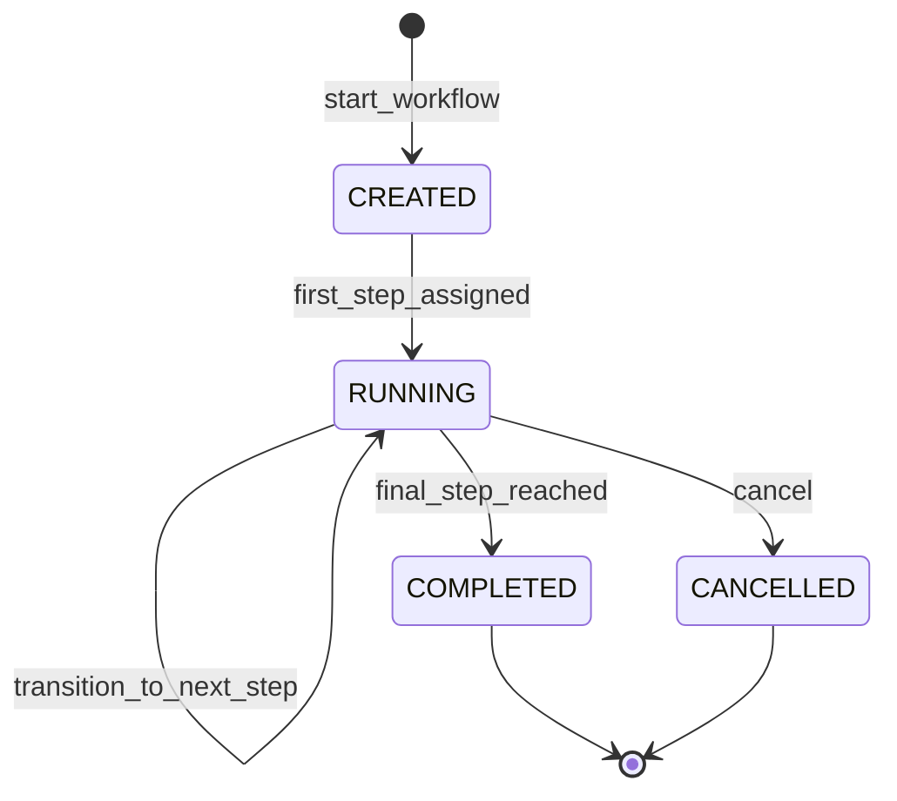
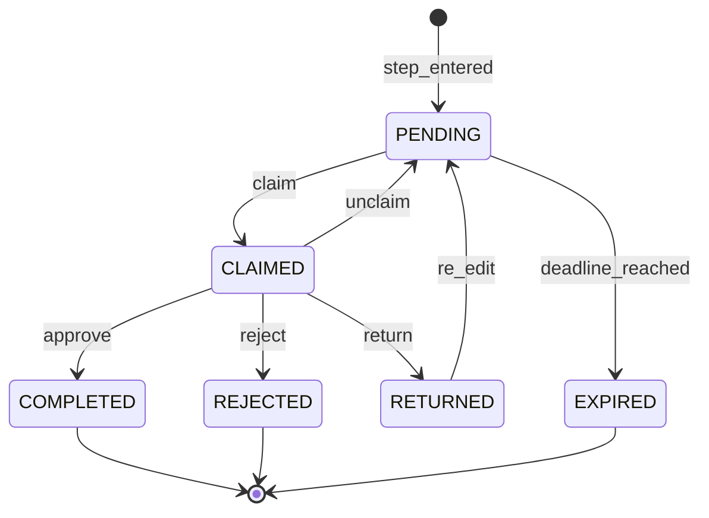
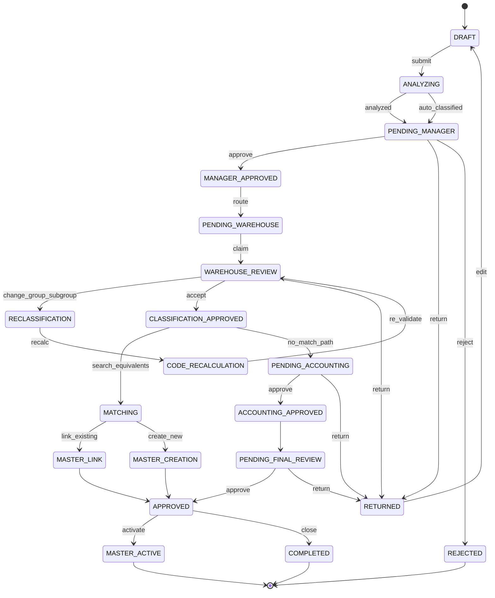
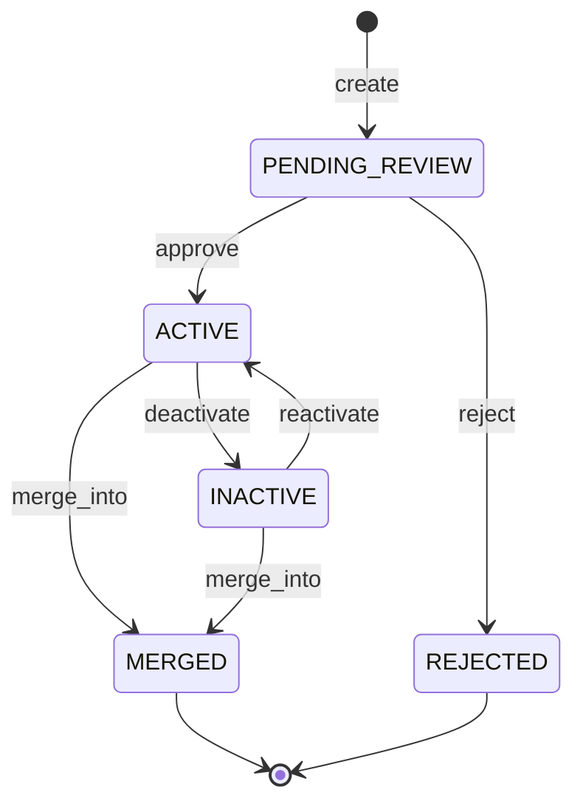
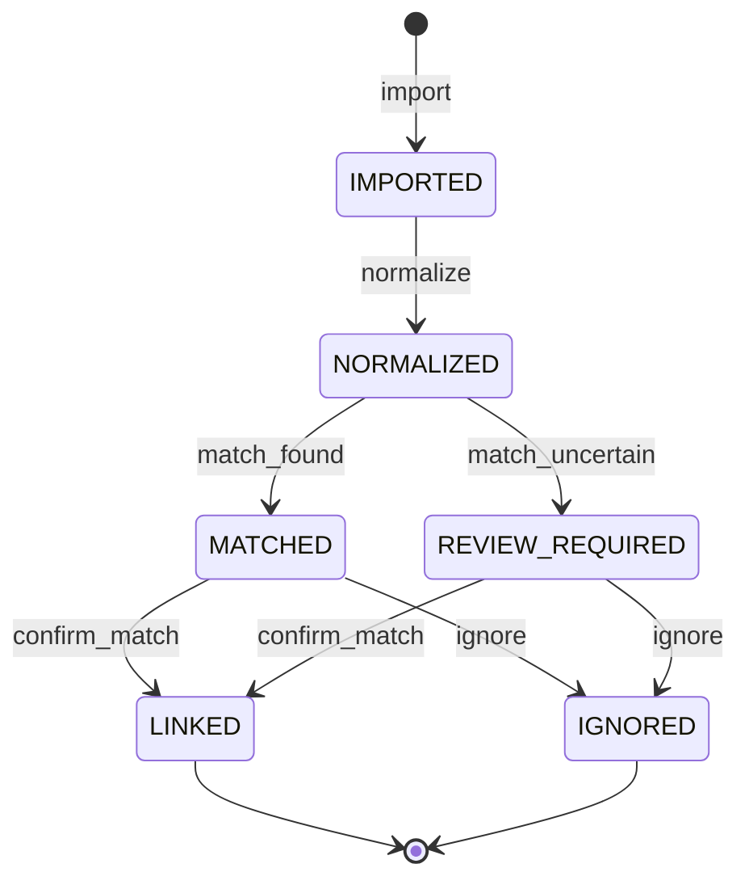
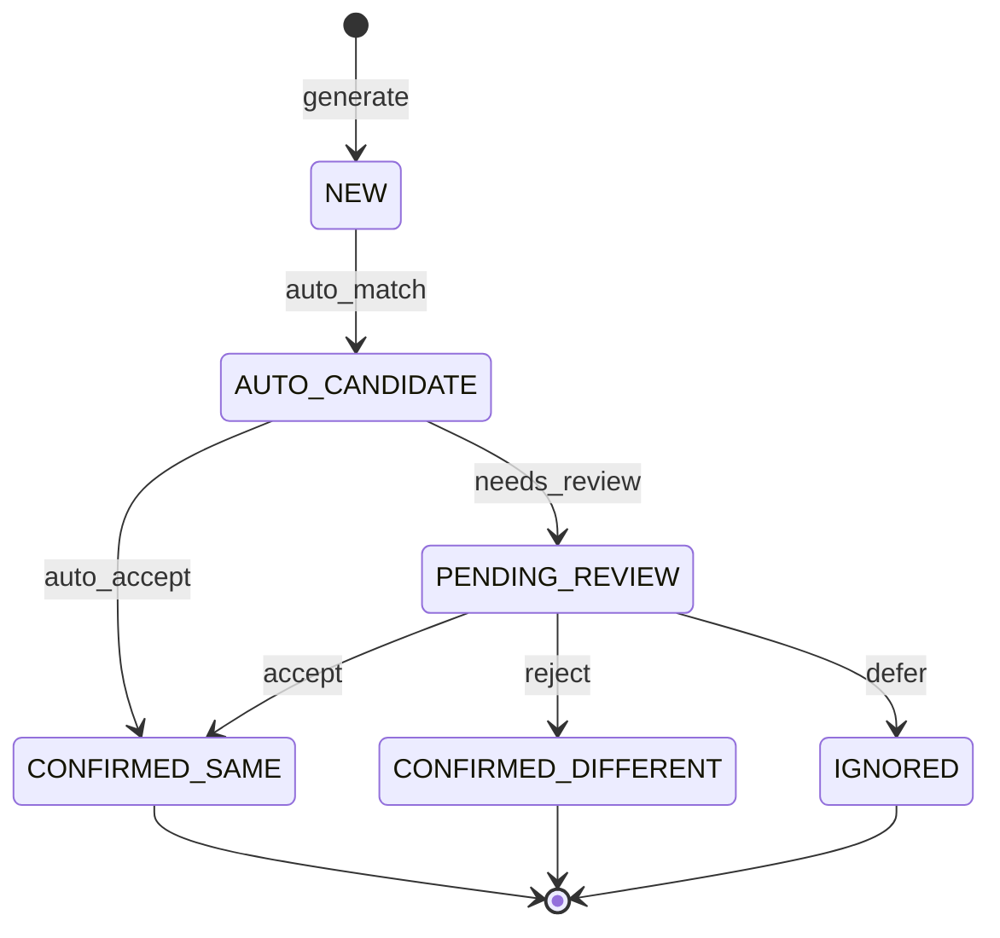
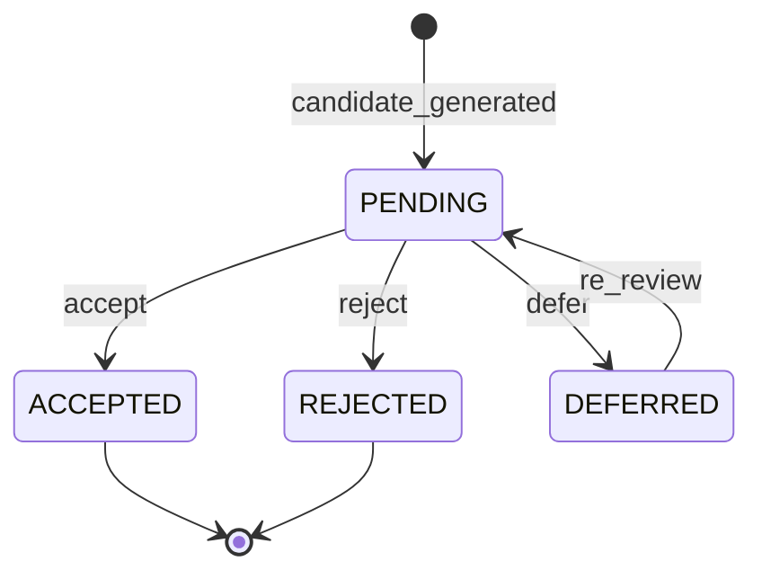
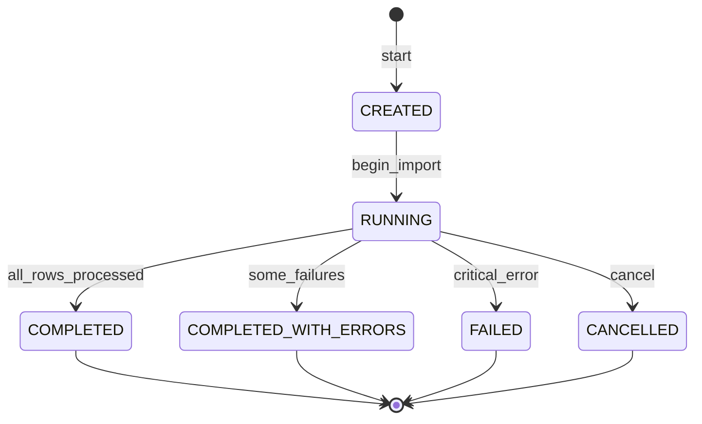
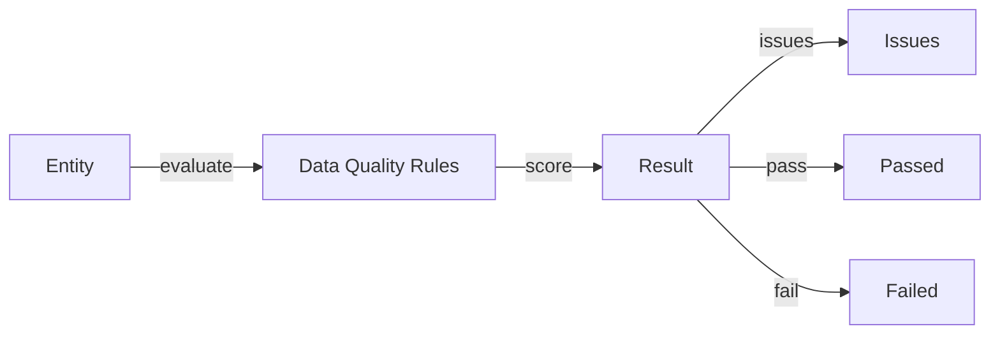
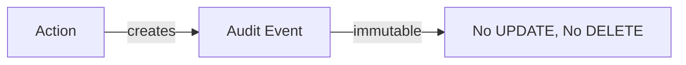

# Máquinas de estados

## 1. Workflow Instance

La máquina de estados real del workflow opera sobre `workflow_instances`.

### Estados

| Estado | Descripción |
|--------|-------------|
| `CREATED` | Instancia creada, primer paso no asignado |
| `RUNNING` | En progreso, al menos un paso activo |
| `COMPLETED` | Workflow terminado (APPROVED o REJECTED) |
| `CANCELLED` | Cancelado por administrador |

### Transiciones

| De | A | Acción | Condición |
|----|---|--------|-----------|
| CREATED | RUNNING | first_step_assigned | Primer paso tiene assigned_to |
| RUNNING | RUNNING | transition_to_next_step | Acción APPROVE en paso actual |
| RUNNING | COMPLETED | final_step_reached | Último paso aprobado |
| RUNNING | CANCELLED | cancel | Acción admin |

## 2. Workflow Task

Cada tarea dentro de un paso del workflow.

### Estados

| Estado | Descripción |
|--------|-------------|
| `PENDING` | Tarea creada, esperando reclamación |
| `CLAIMED` | Un usuario ha reclamado la tarea |
| `COMPLETED` | Tarea terminada con APPROVE |
| `REJECTED` | Tarea terminada con REJECT |
| `RETURNED` | Tarea devuelta para corrección |
| `EXPIRED` | SLA vencido |

### Transiciones

| De | A | Acción | Condición |
|----|---|--------|-----------|
| PENDING | CLAIMED | claim | Usuario con permiso reclama |
| CLAIMED | COMPLETED | approve | Acción APPROVE |
| CLAIMED | REJECTED | reject | Acción REJECT |
| CLAIMED | RETURNED | return | Acción RETURN |
| CLAIMED | PENDING | unclaim | Usuario libera la tarea |
| PENDING | EXPIRED | deadline_reached | due_at alcanzado |
| RETURNED | PENDING | re_edit | Solicitante edita y reenvía |

## 3. Request (Proyección) — Flujo conceptual con Analizador y Clasificación (Fase 0.1)

`requests.status` es una PROYECCIÓN de `workflow_instances.current_step_id`. Los valores posibles se derivan de `workflow_steps.code`. El flujo conceptual completo incluye análisis semántico y validación de clasificación por Almacén.

**Estados analíticos (no todos mapean 1:1 a `workflow_steps.code` pero el concepto es):**

| Estado | Descripción |
|--------|-------------|
| `ANALYZING` | Analizador interpreta descripción (propone grupo/subgrupo, confidence/evidence) |
| `WAREHOUSE_REVIEW` | Almacén revisa propuesta; puede aceptar o modificar |
| `RECLASSIFICATION` | Almacén cambia grupo/subgrupo |
| `CODE_RECALCULATION` | Recálculo `master_code = <NUEVO_GRUPO><NUEVO_SUBGRUPO><SEQUENCE>` — nunca conservar código viejo |
| `CLASSIFICATION_APPROVED` | Clasificación validada por Almacén |
| `MATCHING` | Búsqueda de equivalentes (Analyzer ≠ Matching) |
| `MASTER_LINK / MASTER_CREATION` | Vincular a Master existente o crear nuevo |

> **Regla Fase 0.1:** Si `WAREHOUSE_REVIEW` modifica grupo/subgrupo, el flujo **debe** pasar por `RECLASSIFICATION → CODE_RECALCULATION → WAREHOUSE_REVIEW` antes de avanzar. Estado inconsistente `grupo=ABC, código=RVHCAR...` es inválido.

### Nota importante

Este diagrama muestra los estados PROYECTADOS en `requests.status` + estados conceptuales del pipeline (analizador/matching). La transición real ocurre en `workflow_instances` y `workflow_tasks`. `requests.status` se actualiza como consecuencia. Los pasos `ANALYZING/RECLASSIFICATION/CODE_RECALCULATION/MATCHING` pueden modelarse como sub-estados de `PENDING_WAREHOUSE` o como `workflow_steps` separados según configuración.

### Estados derivados de workflow_steps.code

| Estado en requests.status | Equivalente en workflow_steps.code |
|--------------------------|-------------------------------------|
| `DRAFT` | `DRAFT` |
| `PENDING_MANAGER` | `PENDING_MANAGER` |
| `MANAGER_APPROVED` | `MANAGER_APPROVED` |
| `PENDING_WAREHOUSE` | `PENDING_WAREHOUSE` |
| `WAREHOUSE_APPROVED` | `WAREHOUSE_APPROVED` |
| `PENDING_ACCOUNTING` | `PENDING_ACCOUNTING` |
| `ACCOUNTING_APPROVED` | `ACCOUNTING_APPROVED` |
| `PENDING_FINAL_REVIEW` | `PENDING_FINAL_REVIEW` |
| `APPROVED` | `APPROVED` |
| `MASTER_ACTIVE` | `MASTER_ACTIVE` |
| `RETURNED` | `RETURNED` (cualquier retorno) |
| `REJECTED` | `REJECTED` |

## 4. Master Item

### Estados

| Estado | Descripción | Reglas |
|--------|-------------|--------|
| `PENDING_REVIEW` | Recién creado, esperando revisión | Puede pasar a ACTIVE o REJECTED |
| `ACTIVE` | Artículo maestro activo | Puede ser usado en operaciones |
| `INACTIVE` | Desactivado temporalmente | Puede reactivarse |
| `MERGED` | Fusionado en otro master | `merged_into_id` debe ser NOT NULL |
| `REJECTED` | Rechazado permanentemente | Estado terminal |

### Transiciones

| De | A | Acción | Condición |
|----|---|--------|-----------|
| PENDING_REVIEW | ACTIVE | approve | Validación completa |
| PENDING_REVIEW | REJECTED | reject | No cumple requisitos |
| ACTIVE | INACTIVE | deactivate | Decisión administrativa |
| ACTIVE | MERGED | merge_into | Fusionado con otro master |
| INACTIVE | ACTIVE | reactivate | Decisión administrativa |
| INACTIVE | MERGED | merge_into | Fusionado con otro master |

### Constraints

- Si `status = 'MERGED'` entonces `merged_into_id IS NOT NULL`
- Si `status != 'MERGED'` entonces `merged_into_id IS NULL`
- `merged_into_id != id` (no auto-fusión)

## 5. Source Record

### Estados

| Estado | Descripción |
|--------|-------------|
| `IMPORTED` | Recién importado desde Profit |
| `NORMALIZED` | Texto normalizado aplicado |
| `MATCHED` | Candidato de matching encontrado |
| `REVIEW_REQUIRED` | Requiere revisión humana |
| `LINKED` | Vinculado a master item |
| `IGNORED` | Ignorado intencionalmente |

## 6. Match Candidate

### Estados

| Estado | Descripción |
|--------|-------------|
| `NEW` | Candidato recién generado |
| `AUTO_CANDIDATE` | Detectado por algoritmo automático |
| `PENDING_REVIEW` | Esperando decisión humana |
| `CONFIRMED_SAME` | Confirmado como mismo artículo |
| `CONFIRMED_DIFFERENT` | Confirmado como diferente |
| `IGNORED` | Ignorado o pospuesto |

## 7. Match Decision

### Estados

| Estado | Descripción |
|--------|-------------|
| `ACCEPTED` | Candidato aceptado como mismo artículo |
| `REJECTED` | Candidato rechazado |
| `DEFERRED` | Pospuesto para revisión futura |

### Regla anti-repetición

Si un candidato es REJECTED con una versión de algoritmo específica, el mismo algoritmo/version no debe proponerlo nuevamente. Si cambia la versión del algoritmo o los datos del source_item, SÍ puede re-proponerse.

## 8. Import Run

### Estados

| Estado | Descripción |
|--------|-------------|
| `CREATED` | Importación creada, no iniciada |
| `RUNNING` | En progreso |
| `COMPLETED` | Todas las filas procesadas exitosamente |
| `COMPLETED_WITH_ERRORS` | Procesada con algunos errores |
| `FAILED` | Error crítico, no completada |
| `CANCELLED` | Cancelada por el usuario |

## 9. Data Quality

No es una máquina de estados formal. Es una evaluación puntual.

### Evaluated entity types

| entity_type | Descripción |
|-------------|-------------|
| `SOURCE_ITEM` | Artículo importado de Profit |
| `MASTER_ITEM` | Artículo maestro |
| `REQUEST` | Solicitud de nuevo artículo |

## 10. Audit Event

No es una máquina de estados. Cada evento es inmutable.

### Regla

Los eventos de auditoría SON INMUTABLES. Nunca se actualizan ni eliminan.
